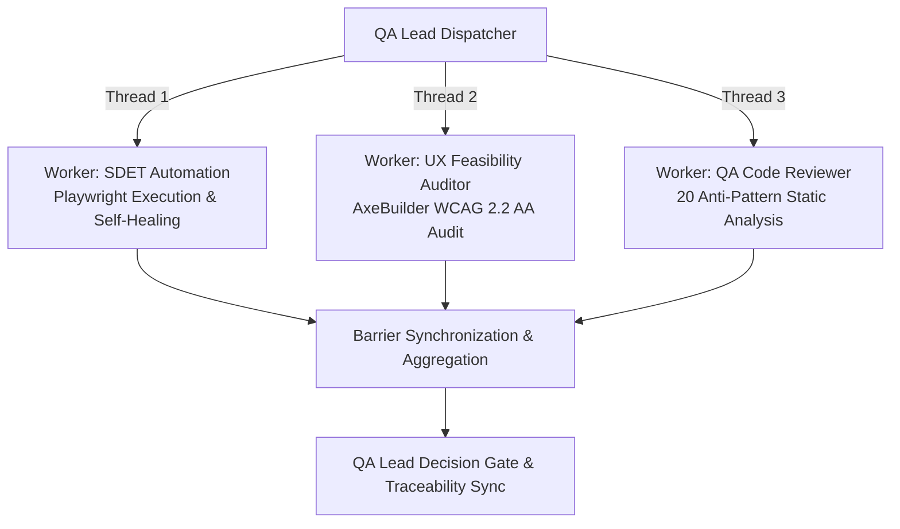

# QA Autonomous Agent Squad & Parallel Multi-Agent Threading

This directory defines the specialized QA agent squad personas for the Playwright automation framework. These agents collaborate across test generation, execution, healing, code review, accessibility auditing, and quality gates.

---

## Agent Squad Directory

| Agent Persona File | Role | Primary Responsibilities | Active Skills |
| :--- | :--- | :--- | :--- |
| [`qa-lead.md`](./qa-lead.md) | **Lead QA & Strategist** | Test strategy, risk classification, parallel swarm dispatching, Release Gate enforcement. | `ship-gate`, `performance-profiler` |
| [`sdet-automation.md`](./sdet-automation.md) | **Senior SDET Engineer** | Playwright test authoring, fixture design, POM maintenance, locator repairs. | `playwright-pro`, `pw-generate`, `pw-fix`, `pw-review`, `focused-fix` |
| [`qa-code-reviewer.md`](./qa-code-reviewer.md) | **QA Code Reviewer & Gatekeeper** | Pre-merge reviews, enforcing the 20 anti-patterns check, state isolation verification. | `pw-review`, `code-reviewer`, `ship-gate` |
| [`ux-feasibility-auditor.md`](./ux-feasibility-auditor.md) | **UX & Feasibility Auditor** | WCAG 2.2 Level AA accessibility scans, form validation UX, responsive layout audit. | `a11y-audit`, `ux-researcher-designer`, `form-cro` |
| [`test-ingestion-orchestrator.md`](./test-ingestion-orchestrator.md) | **Test Ingestion Orchestrator** | Normalizing TMS exports (TestRail, Xray, Markdown) into test manifests and specs. | `senior-qa`, `api-test-suite-builder` |
| [`test-architect.md`](./test-architect.md) | **Test Architect** | Complex system test architecture, fixture design, and test isolation patterns. | `playwright-pro`, `pw-coverage` |
| [`test-debugger.md`](./test-debugger.md) | **Test Debugger** | Root-cause taxonomy analysis of flaky and intermittent failures. | `pw-fix`, `focused-fix` |
| [`migration-planner.md`](./migration-planner.md) | **Migration Planner** | End-to-end migration strategy from Cypress / Selenium to Playwright. | `pw-migrate` |

---

## True Parallel Multi-Agent Threading Architecture

The framework features a concurrent multi-agent execution engine in [`scripts/multi-agent-orchestrator.ts`](../../scripts/multi-agent-orchestrator.ts) that allows agents to execute tasks simultaneously rather than waiting in sequential bottlenecks:



### Running the Multi-Agent Swarm

Trigger all worker threads concurrently via npm:

```bash
# Run full parallel multi-agent swarm
npm run agent:swarm

# Or alias
npm run agent:parallel
```

### Thread Telemetry & Artifacts
Each worker thread outputs structured telemetry into `test-results/agents/`:
- `sdet-automation.json`: Test execution status, duration, failure traces.
- `ux-feasibility-auditor.json`: WCAG 2.2 Level AA rule violations and passes.
- `qa-code-reviewer.json`: File-by-file scores and anti-pattern findings.
- `qa-lead-consolidated-report.json`: Consolidated multi-agent execution report.
- `multi-agent-execution-summary.md`: Human-readable executive release gate summary.
