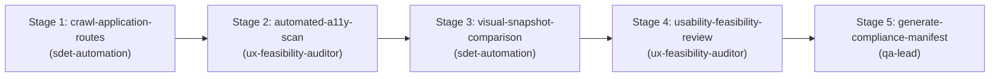

# Visual & Accessibility Gatekeeper Skill

This skill orchestrates the multi-agent DAG workflow to crawl application routes, audit for WCAG 2.2 Level AA accessibility violations, capture and diff visual layout snapshots across responsive viewports, and generate compliance release manifests.

## Supported Inputs
- **Base Application URL** (`base_url`): Root URL of the application.
- **Route Matrix** (`routes`): List of routes or views to audit (e.g., `/`, `/login`, `/dashboard`, `/checkout`).
- **Target Viewports** (`viewports`): Desktop (1280x800), Tablet (768x1024), and Mobile (375x667).

---

## Directed Acyclic Graph (DAG) Execution Stages

### Stage 1: Crawl Application Routes (`crawl-application-routes`)
- **Agent**: `sdet-automation`
- **Action**: Discover interactive pages, forms, modals, and authenticated states.
- **Input configuration**: [resources/audit-config.json](./resources/audit-config.json).

### Stage 2: Automated Accessibility Scan (`automated-a11y-scan`)
- **Agent**: `ux-feasibility-auditor` (using skill `a11y-audit`)
- **Prerequisite**: Depends on `crawl-application-routes`.
- **Action**: Run automated checks for WCAG 2.2 Level A and AA violations (color contrast, ARIA landmarks, form labels, focus rings).

### Stage 3: Visual Snapshot Comparison (`visual-snapshot-comparison`)
- **Agent**: `sdet-automation` (using skill `playwright-pro`)
- **Prerequisite**: Depends on `automated-a11y-scan`.
- **Action**:
  - Capture visual baselines and diffs across viewports using `expect(page).toHaveScreenshot()`.
  - Reference example: [examples/audit-spec.example.ts](./examples/audit-spec.example.ts).

### Stage 4: Usability & Feasibility Review (`usability-feasibility-review`)
- **Agent**: `ux-feasibility-auditor`
- **Prerequisite**: Depends on `visual-snapshot-comparison`.
- **Action**: Audit keyboard navigation sequences (Tab / Shift+Tab), focus traps in modals, and tap target sizes (min 24x24px).

### Stage 5: Generate Compliance Manifest (`generate-compliance-manifest`)
- **Agent**: `qa-lead`
- **Prerequisite**: Depends on `usability-feasibility-review`.
- **Action**:
  - Collate findings into an executive markdown compliance report.
  - Fail release gate if any critical WCAG AA or visual regressions are detected.
