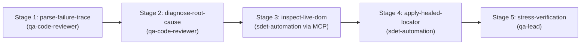

# Flaky Test Triage & Self-Healing Skill

This skill orchestrates the multi-agent DAG workflow to investigate test failures, extract Playwright trace artifacts, inspect live DOM state via MCP, self-heal brittle or drifted locators, and stress-test the repaired test.

## Supported Inputs
- **Test Failure Trace / Artifact** (`trace_path`): Path to `trace.zip`, error screenshots, or failure logs.
- **Failing Test Spec Path** (`spec_path`): Path to the failing spec file in `tests/`.
- **Target Application URL / Route** (`app_url`): Live URL for MCP DOM inspection.

---

## Directed Acyclic Graph (DAG) Execution Stages

### Stage 1: Parse Failure Trace (`parse-failure-trace`)
- **Agent**: `qa-code-reviewer`
- **Action**: Ingest error stack traces, execution context, failure screenshots, and console error logs.
- **Input schema**: [resources/failure-schema.json](./resources/failure-schema.json).
- **Command**: `npx playwright show-trace <trace-path>`

### Stage 2: Diagnose Root Cause (`diagnose-root-cause`)
- **Agent**: `qa-code-reviewer`
- **Prerequisite**: Depends on `parse-failure-trace`.
- **Action**: Classify failure into one of:
  - **Selector Drift**: Element selector changed or element became non-unique.
  - **Hydration / Animation Race**: DOM existed before click handler attached.
  - **Application Defect**: Actual functional bug (abort healing, file bug report).
  - **Environmental / Timeout**: Network blip or slow staging response.

### Stage 3: Inspect Live DOM via MCP (`inspect-live-dom`)
- **Agent**: `sdet-automation` (using MCP tool `@playwright/mcp`)
- **Prerequisite**: Depends on `diagnose-root-cause`.
- **Action**: Navigate to target route, snapshot accessible role tree, and discover resilient `getByRole` or `getByLabel` locators.

### Stage 4: Apply Healed Locator (`apply-healed-locator`)
- **Agent**: `sdet-automation` (using skill `playwright-pro`)
- **Prerequisite**: Depends on `inspect-live-dom`.
- **Action**:
  - Update Page Object Model or spec with resilient locator.
  - Eliminate artificial delays; ensure auto-waiting web-first assertions.
  - Reference example: [examples/healed-spec.example.ts](./examples/healed-spec.example.ts).

### Stage 5: Flakiness Stress Verification (`stress-verification`)
- **Agent**: `qa-lead`
- **Prerequisite**: Depends on `apply-healed-locator`.
- **Action**:
  - Run healed test 5x consecutively: `npx tsx scripts/verify-spec-execution.ts --spec <path> --stress 5`.
  - Certify 100% pass rate before updating PR or resolving failure incident.
