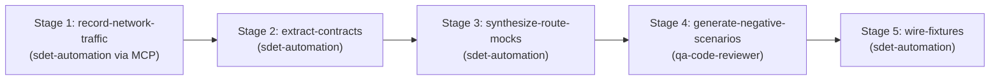

# Network Mock & API Contract Synthesis Skill

This skill orchestrates the multi-agent DAG workflow to capture network traffic, extract dynamic JSON contracts, synthesize isolated `page.route()` handlers, and generate negative scenarios (401 Unauthorized, 500 Server Error, slow latency).

## Supported Inputs
- **Application URL / Route** (`route_url`): Interactive page with backend API dependencies.
- **Captured HAR / Network Log** (`har_path`): Recorded HTTP transactions or proxy traffic.
- **Contract Schema / Definition** (`api_schema`): OpenAPI or JSON schema if available.

---

## Directed Acyclic Graph (DAG) Execution Stages

### Stage 1: Record Network Traffic (`record-network-traffic`)
- **Agent**: `sdet-automation` (using MCP tool `@playwright/mcp`)
- **Action**: Interactively exercise target workflows while capturing XHR / fetch requests and responses.
- **Command**: `npx playwright codegen --save-har=manual-tests/incoming/network.har`

### Stage 2: Extract Contracts & Payloads (`extract-contracts`)
- **Agent**: `sdet-automation`
- **Prerequisite**: Depends on `record-network-traffic`.
- **Action**: Parse dynamic endpoints, request headers, query params, and JSON payloads into schema.
- **Reference schema**: [resources/network-contract.json](./resources/network-contract.json).

### Stage 3: Synthesize Route Mocks (`synthesize-route-mocks`)
- **Agent**: `sdet-automation` (using skill `playwright-pro`)
- **Prerequisite**: Depends on `extract-contracts`.
- **Action**:
  - Generate declarative `await page.route('**/api/...', async route => ...)` handlers.
  - Mock successful responses (200 OK) with realistic fixtures.
  - Reference example: [examples/mocked-routes.example.ts](./examples/mocked-routes.example.ts).

### Stage 4: Generate Negative Scenarios (`generate-negative-scenarios`)
- **Agent**: `qa-code-reviewer` + `sdet-automation`
- **Prerequisite**: Depends on `synthesize-route-mocks`.
- **Action**:
  - Synthesize edge cases: 401 Unauthorized (redirect to login), 500 Internal Server Error (error banner displayed), and throttled network (loading spinner verification).

### Stage 5: Wire Fixtures into Test Suites (`wire-fixtures`)
- **Agent**: `sdet-automation`
- **Prerequisite**: Depends on `generate-negative-scenarios`.
- **Action**:
  - Register route mock handlers into `tests/fixtures/baseTest.ts` or scoped test fixtures.
  - Verify spec runs cleanly without relying on live backend servers.
