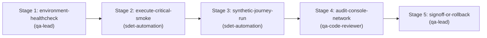

# Release Certification & Synthetic Smoke Skill

This skill orchestrates the multi-agent DAG workflow to certify staging or production environments before and after deployments. It runs multi-browser critical smoke tests, executes synthetic primary customer journeys, audits runtime console/network errors, and provides an authoritative GO / NO-GO release gate.

## Supported Inputs
- **Deployment Environment URL** (`env_url`): Target staging, canary, or production endpoint.
- **Release Version / Tag** (`release_tag`): Semantic version or commit SHA being deployed.
- **SLA Thresholds** (`sla_config`): Max response latency, zero unhandled errors.

---

## Directed Acyclic Graph (DAG) Execution Stages

### Stage 1: Environment Healthcheck (`environment-healthcheck`)
- **Agent**: `qa-lead`
- **Action**: Probe HTTP status of base URL, verify SSL certificate validity, and ping backend `/health` endpoint.
- **Input criteria**: [resources/release-criteria.json](./resources/release-criteria.json).

### Stage 2: Execute Critical Smoke Suite (`execute-critical-smoke`)
- **Agent**: `sdet-automation`
- **Prerequisite**: Depends on `environment-healthcheck`.
- **Action**: Execute smoke test suite across all configured browser engines (Chromium, Firefox, WebKit).
- **Command**: `npm run test:smoke`

### Stage 3: Synthetic Customer Journey Run (`synthetic-journey-run`)
- **Agent**: `sdet-automation` (using skill `playwright-pro`)
- **Prerequisite**: Depends on `execute-critical-smoke`.
- **Action**: Execute core revenue path (e.g. login -> browse -> add to cart -> checkout) using synthetic test credentials.

### Stage 4: Audit Console & Network Hygiene (`audit-console-network`)
- **Agent**: `qa-code-reviewer`
- **Prerequisite**: Depends on `synthetic-journey-run`.
- **Action**: Verify zero uncaught JavaScript exceptions, zero broken asset requests (404s), and zero failed backend API calls (500s).

### Stage 5: Signoff or Rollback Decision (`signoff-or-rollback`)
- **Agent**: `qa-lead` (using skill `ship-gate`)
- **Prerequisite**: Depends on `audit-console-network`.
- **Action**:
  - Issue definitive **GO** or **NO-GO** certification decision.
  - Publish executive certification markdown report.
  - Reference example: [examples/certification-report.example.md](./examples/certification-report.example.md).
