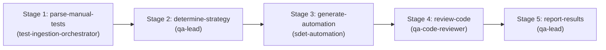

# Test Automation Generation Skill

This skill orchestrates the multi-agent DAG workflow that transforms manual test cases or specifications into production-grade `@playwright/test` TypeScript suites.

## Supported Inputs
- **Copy-Pasted Test Steps / User Flow** (`copy_paste_steps`): Raw step instructions, preconditions, and assertions.
- **Manual Test CSV / Manifest** (`manual_test_csv`): Files from `manual-tests/incoming/` or [resources/manual-tests.csv](./resources/manual-tests.csv).
- **Live URL / Application Route**: Web address to explore, discover locators, and automate.

---

## Directed Acyclic Graph (DAG) Execution Stages

### Stage 1: Parse Manual Tests (`parse-manual-tests`)
- **Agent**: `test-ingestion-orchestrator`
- **Action**: Ingest manual files from `manual-tests/incoming/` or parse provided steps.
- **Command**: `npm run parse:manual`
- **Output**: `manual-tests/parsed/test-manifest.json`

### Stage 2: Determine Strategy & Scope (`determine-strategy`)
- **Agent**: `qa-lead` + `sdet-automation`
- **Prerequisite**: Depends on `parse-manual-tests`.
- **Action**: Evaluate each test case's risk and intent. Strictly classify as either:
  - **Smoke** (`@smoke`): Critical path, core journey sanity.
  - **Regression** (`@regression`): Comprehensive workflows, boundary and error states.

### Stage 3: Generate Automation Specs (`generate-automation`)
- **Agent**: `sdet-automation` (using skill `playwright-pro`)
- **Prerequisite**: Depends on `determine-strategy`.
- **Action**:
  - Map actions to existing Page Object Models (`pages/`) or extend `pages/BasePage.ts`.
  - Use custom test fixture from `tests/fixtures/baseTest.ts`.
  - Strictly use accessible locators (`getByRole`, `getByLabel`, `getByPlaceholder`).
  - Output specs into appropriate directories:
    - Smoke: `tests/smoke/<feature>.smoke.spec.ts`
    - Regression: `tests/regression/<feature>.spec.ts`
  - Reference example: [examples/generated.spec.ts.example](./examples/generated.spec.ts.example).

### Stage 4: Code Review & Dynamic Verification (`review-code`)
- **Agent**: `qa-code-reviewer`
- **Prerequisite**: Depends on `generate-automation`.
- **Action**:
  - Forbid `page.waitForTimeout()`.
  - Enforce web-first async assertions (`await expect(locator)...`).
  - Verify test independence and isolation.
  - **Dynamic Execution Trial**: Execute the synthesized spec (`npx tsx scripts/verify-spec-execution.ts --spec <path>`) to guarantee runtime compilation and clean DOM execution.

### Stage 5: Flakiness Stress Certification & Reporting (`report-results`)
- **Agent**: `qa-lead`
- **Prerequisite**: Depends on `review-code`.
- **Action**:
  - **Stress Testing Certification**: Execute repeat loop (`npx tsx scripts/verify-spec-execution.ts --spec <path> --stress 3` or `npm run test:stress`) to prove zero flakiness.
  - Update `manual-tests/traceability-matrix.md` with status `Automated`.
  - Run verification tests: `npx playwright test <path>`.
