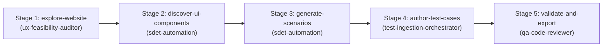

# Test Case Generation Skill

This skill orchestrates the multi-agent DAG workflow that discovers application flows and generates structured, human-readable manual test cases.

## Supported Inputs
- **Live URL / Application Route**: Navigate and inspect with Playwright MCP.
- **Copy-Pasted Instructions / User Stories** (`copy_paste_instructions`): High-level feature requests, user stories, or unstructured steps.

---

## Directed Acyclic Graph (DAG) Execution Stages

### Stage 1: Explore Website (`explore-website`)
- **Agent**: `ux-feasibility-auditor` + Playwright MCP
- **Action**: Crawl target URL to identify views, states, interactive components, and responsive behaviors.

### Stage 2: Discover UI Components (`discover-ui-components`)
- **Agent**: `sdet-automation`
- **Prerequisite**: Depends on `explore-website`.
- **Action**: Map all accessible forms, inputs, buttons, and navigation elements.

### Stage 3: Generate Scenarios (`generate-scenarios`)
- **Agent**: `sdet-automation` (using skill `playwright-pro`)
- **Prerequisite**: Depends on `discover-ui-components`.
- **Action**: Synthesize comprehensive test matrix covering positive paths, negative edge cases, validation errors, and accessibility considerations.

### Stage 4: Author Test Cases (`author-test-cases`)
- **Agent**: `test-ingestion-orchestrator` + `sdet-automation`
- **Prerequisite**: Depends on `generate-scenarios`.
- **Action**: Format into standard structured test cases with ID, Title, Preconditions, Action Steps, and Expected Results.

### Stage 5: Validate and Export (`validate-and-export`)
- **Agent**: `qa-code-reviewer`
- **Prerequisite**: Depends on `author-test-cases`.
- **Action**: Validate completeness, ensure no ambiguous steps, and export to CSV or Jira Xray format.
- **Example Output**: [examples/output-example.csv](./examples/output-example.csv).
