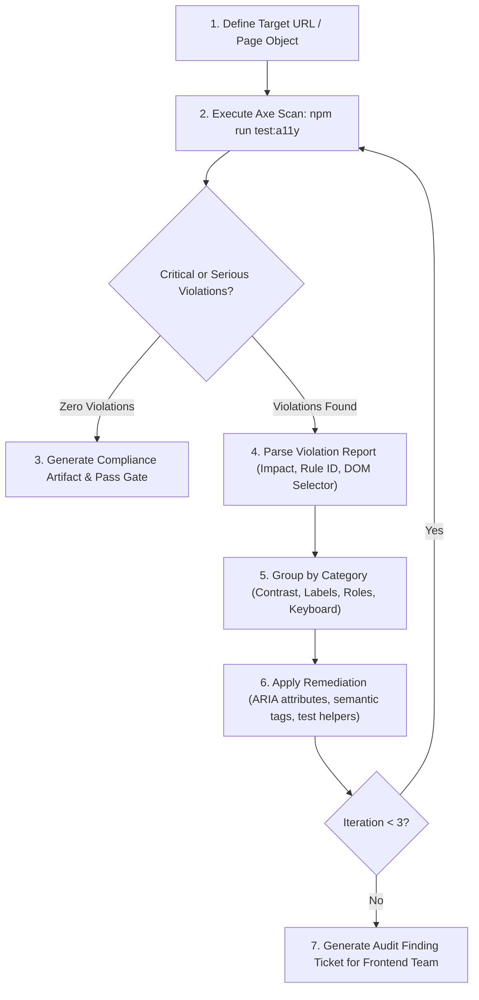

# Workflow: Automated WCAG 2.2 AA Audit & Remediation Loop

## Objective
Continuously verify and enforce web accessibility (a11y) across all user-facing entry points, ensuring full keyboard navigability, screen reader support, valid ARIA semantics, and WCAG 2.2 AA compliance.

---

## Workflow Loop



## Agent Squad & Skill Delegation

| Phase | Acting Agent Persona | Activated Skill | Mandatory Skill Reference | Purpose |
| :--- | :--- | :--- | :--- | :--- |
| **Phase 1: Axe Execution** | [UX & Feasibility Auditor](file:///Users/akash-mac/workspace/playwright-automation/.agents/agents/ux-feasibility-auditor.md) | [`a11y-audit`](file:///Users/akash-mac/workspace/playwright-automation/.agents/skills/a11y-audit/SKILL.md) | [a11y-audit/SKILL.md](file:///Users/akash-mac/workspace/playwright-automation/.agents/skills/a11y-audit/SKILL.md) | Executes `@axe-core/playwright` and maps WCAG 2.2 AA rules. |
| **Phase 2: Triage** | [UX & Feasibility Auditor](file:///Users/akash-mac/workspace/playwright-automation/.agents/agents/ux-feasibility-auditor.md) | [`ux-researcher-designer`](file:///Users/akash-mac/workspace/playwright-automation/.agents/skills/ux-researcher-designer/SKILL.md) | [ux-researcher-designer/SKILL.md](file:///Users/akash-mac/workspace/playwright-automation/.agents/skills/ux-researcher-designer/SKILL.md) | Groups violations into keyboard, contrast, semantics, and ARIA. |
| **Phase 3: Remediation** | [SDET Automation Engineer](file:///Users/akash-mac/workspace/playwright-automation/.agents/agents/sdet-automation.md) | [`form-cro`](file:///Users/akash-mac/workspace/playwright-automation/.agents/skills/form-cro/SKILL.md) | [form-cro/SKILL.md](file:///Users/akash-mac/workspace/playwright-automation/.agents/skills/form-cro/SKILL.md) | Patches form inputs, accessible names, and error announcements. |
| **Phase 4: Compliance Sign-off** | [QA Code Reviewer](file:///Users/akash-mac/workspace/playwright-automation/.agents/agents/qa-code-reviewer.md) | [`ship-gate`](file:///Users/akash-mac/workspace/playwright-automation/.agents/skills/ship-gate/SKILL.md) | [ship-gate/SKILL.md](file:///Users/akash-mac/workspace/playwright-automation/.agents/skills/ship-gate/SKILL.md) | Verifies 0 critical/serious violations before CI pass. |

---

## Execution Runbook

### Phase 1: Automated Axe Execution
1. Run the accessibility smoke suite:
   ```bash
   npm run test:a11y
   ```
2. For ad-hoc or new page audits, instantiate `AxeBuilder` in test fixtures:
   ```typescript
   import AxeBuilder from '@axe-core/playwright';
   
   const results = await new AxeBuilder({ page })
     .withTags(['wcag2a', 'wcag2aa', 'wcag21a', 'wcag21aa', 'wcag22aa'])
     .analyze();
   ```

### Phase 2: Violation Analysis & Triage
1. Filter results by impact level:
   - **Critical**: Missing form input labels, broken keyboard traps, invalid ARIA roles preventing screen reader navigation.
   - **Serious**: Insufficient color contrast ratios (< 4.5:1 for normal text), missing image alt text, empty buttons/links.
   - **Moderate / Minor**: Landmark structure, heading order skipped.
2. Output table of identified issues with HTML snippets and CSS selectors.

### Phase 3: Remediation Loop (Max 3 Cycles)
1. **Remediation Actions**:
   - If test script/POM issue: Update locator to use accessible roles (`getByRole('button', { name: '...' })`, `getByLabel('...')`).
   - If frontend code issue: Add missing `aria-label`, `aria-describedby`, `role`, or contrast fixes.
2. Re-run scan:
   ```bash
   npx playwright test tests/smoke/a11y.smoke.spec.ts --project=Chromium
   ```
3. Repeat until `criticalViolations.length === 0`.
4. If third-party demo restrictions prevent editing frontend DOM directly:
   - Exclude third-party vendor elements with `.exclude('.third-party-widget')`.
   - Document known exceptions in `manual-tests/traceability-matrix.md`.
