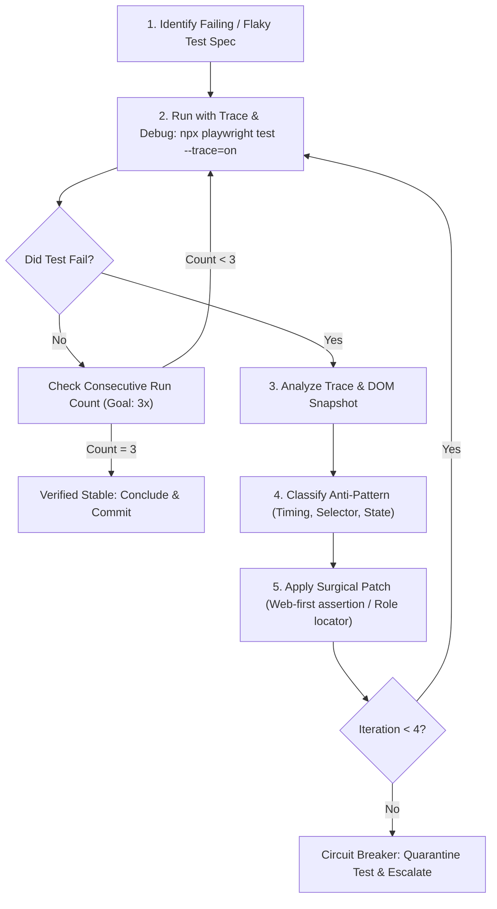

# Workflow: Autonomous Flaky Test Healing Loop

## Objective
Systematically diagnose and remediate flaky or intermittently failing tests by eliminating race conditions, artificial timeouts, and fragile locators, then proving stability via consecutive clean executions.

---

## Workflow Loop



## Agent Squad & Skill Delegation

| Phase | Acting Agent Persona | Activated Skill | Mandatory Skill Reference | Purpose |
| :--- | :--- | :--- | :--- | :--- |
| **Phase 1: Trace Capture** | [SDET Automation Engineer](file:///Users/akash-mac/workspace/playwright-automation/.agents/agents/sdet-automation.md) | Playwright CLI & MCP | `.agents/mcp_config.json` | Runs test with `--trace=on` and captures failure artifacts. |
| **Phase 2: Classification** | [SDET Automation Engineer](file:///Users/akash-mac/workspace/playwright-automation/.agents/agents/sdet-automation.md) | [`focused-fix`](file:///Users/akash-mac/workspace/playwright-automation/.agents/skills/focused-fix/SKILL.md) | [focused-fix/SKILL.md](file:///Users/akash-mac/workspace/playwright-automation/.agents/skills/focused-fix/SKILL.md) | Maps failure boundary (scope $\rightarrow$ trace $\rightarrow$ diagnose). |
| **Phase 3: Patch & Verify** | [SDET Automation Engineer](file:///Users/akash-mac/workspace/playwright-automation/.agents/agents/sdet-automation.md) | [`senior-qa`](file:///Users/akash-mac/workspace/playwright-automation/.agents/skills/senior-qa/SKILL.md) | [senior-qa/SKILL.md](file:///Users/akash-mac/workspace/playwright-automation/.agents/skills/senior-qa/SKILL.md) | Applies web-first assertion / role locator fix and runs 3x stress-test. |
| **Phase 4: Gate Check** | [QA Code Reviewer](file:///Users/akash-mac/workspace/playwright-automation/.agents/agents/qa-code-reviewer.md) | [`code-reviewer`](file:///Users/akash-mac/workspace/playwright-automation/.agents/skills/code-reviewer/SKILL.md) | [code-reviewer/SKILL.md](file:///Users/akash-mac/workspace/playwright-automation/.agents/skills/code-reviewer/SKILL.md) | Validates fix against [playwright-standards.md](file:///Users/akash-mac/workspace/playwright-automation/.agents/rules/playwright-standards.md). |

---

## Execution Runbook

### Phase 1: Isolation & Trace Capture
1. Run the target test with trace recording enabled:
   ```bash
   npx playwright test <path-to-spec> --trace=on --workers=1
   ```
2. If trace file is generated, extract the trace metadata:
   - Identify the exact action that timed out (e.g. `locator.click: Timeout 30000ms exceeded`).
   - Check the action log for element state (`visible`, `enabled`, `stable`).

### Phase 2: Root-Cause Classification
Classify failure into one of 4 root causes:
1. **Brittle Selector**: Selector relies on dynamic classes or complex XPath.
   - *Fix*: Replace with semantic role (`page.getByRole('button', { name: 'Submit' })`) or dedicated test id.
2. **Missing Auto-Waiting**: Assertion evaluated on primitive snapshot before DOM updated (e.g. `expect(await locator.isVisible()).toBe(true)`).
   - *Fix*: Convert to web-first auto-retrying assertion: `await expect(locator).toBeVisible()`.
3. **Shared State / Pollution**: Test depends on cookies, local storage, or data modified by a prior test.
   - *Fix*: Ensure each test creates a clean browser context or uses `beforeEach` data setup.
4. **Network Race Condition**: Action performed before asynchronous request finished.
   - *Fix*: Add `await page.waitForResponse(...)` or await target element visibility. Never add `page.waitForTimeout()`.

### Phase 3: Patch & Stress-Test Verification Loop
1. Apply the fix to the Page Object or spec.
2. **Stress-Test Repeatability**: The test MUST pass **3 consecutive runs** without failure:
   ```bash
   npx playwright test <path-to-spec> --repeat-each=3 --workers=1
   ```
3. If all 3 runs pass:
   - Run linter: `npm run lint`
   - Mark test as healed and conclude.
4. If it fails on any run:
   - Loop back to Phase 2 (up to 4 iterations total).
   - If 4 iterations are exhausted without 3 consecutive passes, apply the `@flaky-quarantine` annotation and notify the QA Lead.
