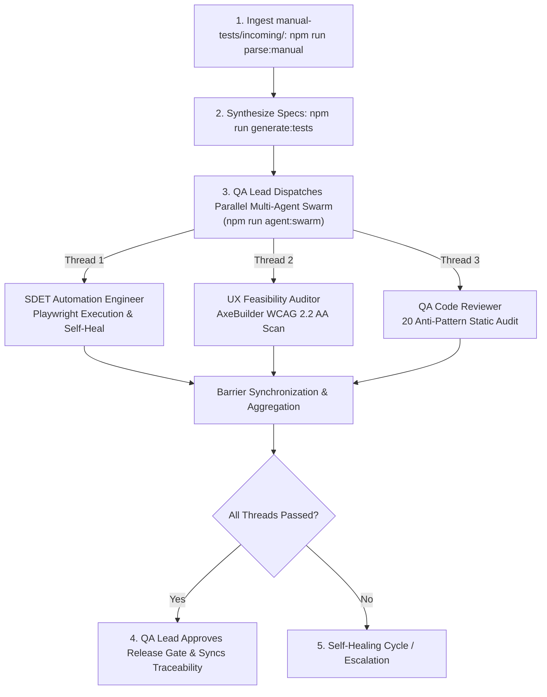

# Workflow: Manual Test Ingestion to Automated Spec Loop

## Objective
Seamlessly convert manual test management exports (TestRail CSV, Jira Xray `.feature`, Zephyr JSON, Markdown) dropped into `manual-tests/incoming/` into production-ready, passing Playwright specs adhering to web-first standards.

---

## Parallel Multi-Agent Swarm Workflow Loop



## Agent Squad & Skill Delegation

To execute this workflow, the QA squad executes in concurrent parallel threads coordinated by the QA Lead:

| Phase | Acting Agent Persona | Activated Skill | Mandatory Skill Reference | Purpose |
| :--- | :--- | :--- | :--- | :--- |
| **Phase 1: Ingestion** | [Test Ingestion Orchestrator](file:///Users/akash-mac/workspace/playwright-automation/.agents/agents/test-ingestion-orchestrator.md) | Built-in CLI Script | `scripts/parse-manual-tests.ts` | Ingests and normalizes heterogeneous TMS files into JSON manifest. |
| **Phase 2: Synthesis** | [SDET Automation Engineer](file:///Users/akash-mac/workspace/playwright-automation/.agents/agents/sdet-automation.md) | [`pw-generate`](file:///Users/akash-mac/workspace/playwright-automation/.agents/skills/pw-generate/SKILL.md) & [`playwright-pro`](file:///Users/akash-mac/workspace/playwright-automation/.agents/skills/playwright-pro/SKILL.md) | [pw-generate/SKILL.md](file:///Users/akash-mac/workspace/playwright-automation/.agents/skills/pw-generate/SKILL.md) | Generates POM classes and scaffolds Playwright test fixtures using 55 templates. |
| **Phase 3: Parallel Swarm** | **QA Lead Dispatcher** | Parallel Worker Threads | `scripts/multi-agent-orchestrator.ts` | Dispatches SDET, UX Auditor, and Code Reviewer concurrently. |
| ↳ *Thread 1* | [SDET Automation Engineer](file:///Users/akash-mac/workspace/playwright-automation/.agents/agents/sdet-automation.md) | [`pw-fix`](file:///Users/akash-mac/workspace/playwright-automation/.agents/skills/pw-fix/SKILL.md) & [`focused-fix`](file:///Users/akash-mac/workspace/playwright-automation/.agents/skills/focused-fix/SKILL.md) | [pw-fix/SKILL.md](file:///Users/akash-mac/workspace/playwright-automation/.agents/skills/pw-fix/SKILL.md) | Runs test suite and applies surgical locator/timing fixes. |
| ↳ *Thread 2* | [UX Feasibility Auditor](file:///Users/akash-mac/workspace/playwright-automation/.agents/agents/ux-feasibility-auditor.md) | [`a11y-audit`](file:///Users/akash-mac/workspace/playwright-automation/.agents/skills/a11y-audit/SKILL.md) | [a11y-audit/SKILL.md](file:///Users/akash-mac/workspace/playwright-automation/.agents/skills/a11y-audit/SKILL.md) | Audits target pages for WCAG 2.2 AA accessibility violations. |
| ↳ *Thread 3* | [QA Code Reviewer](file:///Users/akash-mac/workspace/playwright-automation/.agents/agents/qa-code-reviewer.md) | [`pw-review`](file:///Users/akash-mac/workspace/playwright-automation/.agents/skills/pw-review/SKILL.md) | [pw-review/SKILL.md](file:///Users/akash-mac/workspace/playwright-automation/.agents/skills/pw-review/SKILL.md) | Enforces 20 anti-patterns check (`npm run test:audit`). |
| **Phase 4: Release Gate** | [QA Lead](file:///Users/akash-mac/workspace/playwright-automation/.agents/agents/qa-lead.md) | [`ship-gate`](file:///Users/akash-mac/workspace/playwright-automation/.agents/skills/ship-gate/SKILL.md) | [ship-gate/SKILL.md](file:///Users/akash-mac/workspace/playwright-automation/.agents/skills/ship-gate/SKILL.md) | Evaluates consolidated DoD and updates traceability matrix. |

---

## Execution Runbook

### Phase 1: Ingestion & Normalization
1. Check `manual-tests/incoming/` for new test cases.
2. Run the ingestion parser:
   ```bash
   npm run parse:manual
   ```
3. Inspect `manual-tests/parsed/test-manifest.json` to confirm schema validity (IDs, titles, steps, preconditions, priorities).

### Phase 2: Synthesis & Code Generation
1. Generate initial Playwright spec:
   ```bash
   npm run generate:tests
   ```
2. Verify that any new actions have corresponding methods in `pages/` (e.g., `CartPage.ts`, `LoginPage.ts`). If missing, extend the relevant Page Object Model using accessible `getByRole` or `data-test` locators.

### Phase 3: The Parallel Multi-Agent Swarm Verification
Execute all validation checks in concurrent parallel threads:
1. **Launch Parallel Swarm**:
   ```bash
   npm run agent:swarm
   ```
2. **Evaluate Release Gate**:
   - The orchestrator concurrently verifies Playwright test execution (Thread 1), WCAG 2.2 AA accessibility (Thread 2), and 20 anti-pattern code review (Thread 3).
   - If all threads pass: Proceed to Phase 4.
   - If any thread fails:
     - Review `test-results/agents/multi-agent-execution-summary.md` and specific worker logs in `test-results/agents/`.
     - Apply targeted repairs and re-trigger swarm.

### Phase 4: Traceability & Definition of Done
1. Confirm `manual-tests/traceability-matrix.md` reflects `✅ Automated & Passing` and verified by the Multi-Agent Swarm.
2. Run lint and typecheck:
   ```bash
   npm run lint
   npm run typecheck
   ```
3. Commit generated specs, updated matrix, and swarm telemetry artifacts.
