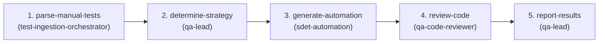

# Playwright Automation Framework & Autonomous QA Squad

This repository is an enterprise test automation framework built with **Playwright**, TypeScript, and integrated **Model Context Protocol (MCP)** support. It provides an autonomous QA squad capable of multi-stage Directed Acyclic Graph (DAG) orchestration for manual test ingestion, automated spec synthesis, accessibility audits, and release quality gates.

---

## 1. Universal Agent & Cross-IDE Contract

This project adheres to the **Universal Agent Standard** (`AGENTS.md` / `CLAUDE.md` / `.mcp.json`).
Whether running in **Antigravity IDE**, **Claude Code**, **Cursor**, **Windsurf**, or **VS Code Copilot**, all agents must follow these operational rules:

1. **Autonomous Orchestration**: The main agent coordinates execution across specialized persona guidelines in `.agents/agents/` and declarative DAG skills in `.agents/skills/`.
2. **Standardized Tooling via MCP**: Use `@playwright/mcp` (configured in `.mcp.json`) for browser exploration, live DOM inspection, and locator verification.
3. **Execution Verification**: After modifying code or tests, always run the relevant validation commands (`npx playwright test <path>`).

---

## 2. Autonomous Squad Personas (`.agents/agents/`)

When executing tasks, embody or delegate to the appropriate specialized role:

| Persona | File Reference | Primary Responsibility |
| :--- | :--- | :--- |
| **Test Ingestion Orchestrator** | [`.agents/agents/test-ingestion-orchestrator.md`](/playwright-automation/.agents/agents/test-ingestion-orchestrator.md) | Ingests manual tests (CSV, Jira/Xray, Zephyr, Markdown), normalizes manifests, updates traceability. |
| **QA Lead** | [`.agents/agents/qa-lead.md`](/playwright-automation/.agents/agents/qa-lead.md) | Risk assessment, coverage gap analysis, classifies tests strictly into `@smoke` vs `@regression`. |
| **SDET Automation Engineer** | [`.agents/agents/sdet-automation.md`](/playwright-automation/.agents/agents/sdet-automation.md) | Page Object Model synthesis (`pages/BasePage.ts`), TypeScript spec generation, accessible locators (uses skill `playwright-pro`). |
| **QA Code Reviewer** | [`.agents/agents/qa-code-reviewer.md`](/playwright-automation/.agents/agents/qa-code-reviewer.md) | Enforces zero-flakiness, rejects `waitForTimeout()`, audits assertions, enforces release gates. |
| **UX & Feasibility Auditor** | [`.agents/agents/ux-feasibility-auditor.md`](/playwright-automation/.agents/agents/ux-feasibility-auditor.md) | WCAG 2.2 AA accessibility verification (`@a11y-audit`), responsive breakpoints, user flow sanity. |

---

## 3. Declarative DAG Skills (`.agents/skills/`)

Multi-stage tasks follow topologically sorted, acyclic dependency stages defined in `.agents/skills/<skill_name>/SKILL.md`:

### A. Test Automation Generation DAG (`test-automation-generation`)

- **Inputs**: Copy-pasted steps, live URLs, or files dropped into `manual-tests/incoming/`.
- **Command**: `npm run parse:manual && npm run generate:tests` (or trigger skill `test-automation-generation`).
- **Outputs**:
  - Smoke tests: `tests/smoke/<feature>.smoke.spec.ts` (tagged `@smoke`)
  - Regression tests: `tests/regression/<feature>.spec.ts` (tagged `@regression`)
  - Traceability: `manual-tests/traceability-matrix.md`

### B. Test Case Generation DAG (`test-case-generation`)
- **Inputs**: Live URL, user story, or unformatted manual steps.
- **Workflow**: `explore-website` -> `discover-ui-components` -> `generate-scenarios` -> `author-test-cases` -> `validate-and-export`.
- **Output**: Normalized test case suites (CSV, JSON, or Markdown).

### C. Flaky Test Triage & Self-Healing DAG (`flaky-test-healing`)
- **Workflow**: `parse-failure-trace` -> `diagnose-root-cause` -> `inspect-live-dom` -> `apply-healed-locator` -> `stress-verification`.
- **Output**: Self-healed Page Objects and specs with zero flakiness.

### D. Network Mock & Contract Synthesis DAG (`network-mock-synthesis`)
- **Workflow**: `record-network-traffic` -> `extract-contracts` -> `synthesize-route-mocks` -> `generate-negative-scenarios` -> `wire-fixtures`.
- **Output**: Isolated `page.route()` handlers for 200, 401, 500, and throttled latency.

### E. Visual & Accessibility Gatekeeper DAG (`a11y-visual-audit`)
- **Workflow**: `crawl-application-routes` -> `automated-a11y-scan` -> `visual-snapshot-comparison` -> `usability-feasibility-review` -> `generate-compliance-manifest`.
- **Output**: WCAG 2.2 AA audit results and `toHaveScreenshot()` visual baseline diffs.

### F. Release Certification & Synthetic Smoke DAG (`release-certification`)
- **Workflow**: `environment-healthcheck` -> `execute-critical-smoke` -> `synthetic-journey-run` -> `audit-console-network` -> `signoff-or-rollback`.
- **Output**: Executive GO / NO-GO deployment certification report.

---

## 4. Non-Negotiable Playwright Engineering Standards

### A. Locator Hierarchy (User-Facing & Accessible First)
Always locate elements in descending order of precedence:
1. `page.getByRole('button' | 'textbox' | 'link', { name: '...' })`
2. `page.getByLabel('...')`
3. `page.getByPlaceholder('...')`
4. `page.getByText('...')`
5. `page.getByTestId('...')` or `page.locator('[data-test="..."]')`
- **FORBIDDEN**: Brittle CSS selectors (`.btn-primary`), deep structural DOM paths (`div > ul > li:nth-child(2)`), or raw XPath.

### B. Web-First Async Assertions & Zero-Timeout Policy
- **ALWAYS** use web-first async assertions:
  ```typescript
  // CORRECT
  await expect(locator).toBeVisible();
  await expect(page).toHaveURL(/.*checkout/);
  ```
- **FORBIDDEN**: Synchronous checks like `expect(await locator.isVisible()).toBe(true)`.
- **FORBIDDEN**: `page.waitForTimeout(...)` under any circumstances. Tests must rely on auto-waiting locators and retrying assertions.

### C. Architecture & File Placement Rules
- **Page Object Models**: Must extend `BasePage` in `pages/BasePage.ts`. Locators are `readonly` class properties.
- **Fixtures**: Always import test from `tests/fixtures/baseTest.ts` to automatically instantiate page objects.
- **Test File Locations**:
  - Smoke: `tests/smoke/*.smoke.spec.ts` (Tagged `@smoke`)
  - Regression: `tests/regression/*.spec.ts` (Tagged `@regression`)
  - Workflow & DAG tests: `tests/workflow/*.spec.ts`
  - **NEVER** write executable tests inside `.agents/` or `manual-tests/`.

### D. Dynamic Execution Trial & Flakiness Stress Gate
- **Dynamic Trial Verification**: Synthesized specs must be executed dynamically via `npm run verify:spec -- --spec <path>` to confirm runtime compilation and pass before approval.
- **Flakiness Stress Certification**: Newly generated or repaired tests must pass consecutive repeat loops (`npm run test:stress` or `--stress 3`) with 100% success rate before merge.

---

## 5. Standard CLI Tooling

```bash
# Execute test suites
npm test                      # Run all tests
npm run test:smoke            # Run fast sanity smoke suite
npm run test:regression       # Run comprehensive regression suite
npm run test:stress           # Run flakiness stress test (--repeat-each=3)
npm run test:headed           # Run headed for visual debugging
npm run test:ui               # Interactive Playwright UI mode
npm run test:report           # View HTML report

# Dynamic Execution Verification & Ingestion
npm run verify:spec -- --spec <path> [--stress N]  # Dynamically verify test execution and flake resistance
npm run parse:manual          # Parse manual test files in manual-tests/incoming/
npm run generate:tests        # Synthesize Playwright test specs from parsed manifest

# MCP Server
npm run mcp:playwright        # Launch Playwright MCP in headless mode
npm run mcp:playwright:headed # Launch Playwright MCP in headed mode
```
