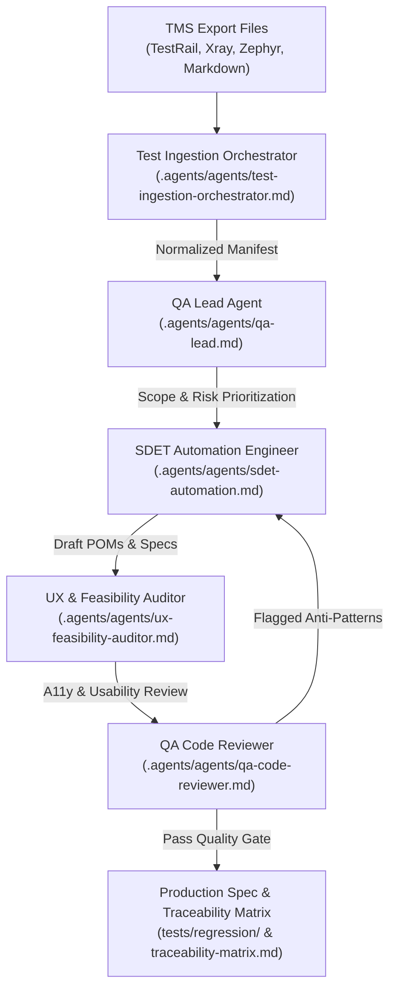

# Playwright Automation Framework & QA Agent Scaffold

A modern test automation framework built with **Playwright**, TypeScript, and integrated **Model Context Protocol (MCP)** support for autonomous QA agents.

---

## Key Highlights

- **Tiered Test Architecture**: Dedicated suites for `@smoke` sanity checks and `@regression` end-to-end user journeys.
- **Autonomous QA Agent Squad**: Embedded AI personas and skills (`.agents/`) for test generation, code reviews, accessibility audits, and release gates.
- **TMS Ingestion & Traceability**: End-to-end orchestration converting manual tests (TestRail, Jira Xray, Zephyr, Markdown) into executable Playwright specs.
- **Playwright MCP Server**: Live browser inspection, accessible locator discovery, and execution via MCP (`@playwright/mcp`).
- **Production CI/CD**: Automated GitHub Actions workflow with executive test summaries, failure annotations, and HTML/trace artifacts.

---

## Core Project Structure

| Directory | Purpose |
| :--- | :--- |
| `tests/` | Playwright test suites (`smoke/`, `regression/`) and fixtures (`fixtures/baseTest.ts`) |
| `pages/` | Page Object Models extending `BasePage` |
| `manual-tests/` | Ingestion dropzone (`incoming/`), parsed manifests, and traceability matrix |
| `.agents/` | Agent squad personas, MCP configuration, and QA skills (Playwright Pro, A11y, UX) |
| `scripts/` | TMS parsing and automated spec generation scripts |

---

## Getting Started

### 1. Installation
```bash
git clone https://github.com/skyvas/playwright-automation.git
cd playwright-automation
npm install
npx playwright install --with-deps
cp .env.example .env
```

### 2. Running Tests
```bash
# Run all tests
npm test

# Run critical smoke tests
npm run test:smoke

# Run full regression suite
npm run test:regression

# Interactive UI mode
npm run test:ui

# View HTML report
npm run test:report
```

---

## Agent-Driven Ingestion Pipeline & Orchestration

This framework features an autonomous orchestration pipeline where specialized AI agents under `.agents/` collaborate to convert manual test exports into verified, industry-standard Playwright automation:



### Step-by-Step Agent Pipeline:

1. **Ingestion & Normalization (`test-ingestion-orchestrator`)**
   - Ingests manual test cases dropped in `manual-tests/incoming/` across supported formats (TestRail CSV, Jira Xray `.feature`, Zephyr JSON, Markdown).
   - Normalizes heterogeneous test data into a unified schema: `manual-tests/parsed/test-manifest.json` (`npm run parse:manual`).

2. **Test Strategy & Risk Prioritization (`qa-lead`)**
   - Evaluates test intent and tags suites appropriately (`@smoke` for critical path sanity checks, `@regression` for full flows).
   - Audits coverage gaps across critical user journeys and assigns execution priorities.

3. **Page Object & Spec Synthesis (`sdet-automation`)**
   - Matches manual actions to existing Page Object Models (`pages/`) or extends `BasePage` with new elements.
   - Generates executable Playwright test specs using custom fixtures (`tests/fixtures/baseTest.ts`), accessible locators (`getByRole`, `getByLabel`), and web-first async assertions (`expect(locator).toBeVisible()`).

4. **UX & Accessibility Verification (`ux-feasibility-auditor`)**
   - Validates user journey feasibility, form input edge cases, error messaging, and WCAG 2.2 Level AA accessibility standards.

5. **Rigorous Review & Quality Gatekeeping (`qa-code-reviewer`)**
   - Performs automated static and behavioral code review: strictly rejects anti-patterns (no hardcoded `page.waitForTimeout()`, no brittle XPath/CSS).
   - Enforces test state independence and auto-retrying assertions.
   - Enforces the Definition of Done (`ship-gate`), logs verification, and updates `manual-tests/traceability-matrix.md`.

---

## Working with Agents (Example Prompts)

Trigger the embedded QA Agent Squad using natural language queries in your AI assistant (e.g. Antigravity, Claude Code, Cursor):

### 1. Ingest Manual Tests & Generate Automation
> *"Ingest the manual test export files from `manual-tests/incoming/`. Parse the test manifest, map steps to existing Page Object Models, generate Playwright specs adhering to industry standards, and update the traceability matrix."*

### 2. Generate a New Feature Test Spec
> *"Write an automated Playwright smoke test for the user checkout flow using our Page Object Model in `pages/` and custom test fixture. Ensure all locators use `getByRole` and assertions are web-first."*

### 3. QA Code Review & Flakiness Remediation
> *"Review `tests/regression/ingested-tests.spec.ts` against our Playwright standards. Check for hardcoded timeouts, fragile CSS/XPath selectors, or missing assertions, and fix any violations."*

### 4. Accessibility & Performance Audits
> *"Run an accessibility audit on the login and inventory pages using the `@a11y-audit` skill. Verify WCAG 2.2 Level AA compliance and report any contrast or label violations."*

---

## Playwright MCP Server Integration

Enable live browser control and DOM inspection for AI agents via Model Context Protocol:

```bash
# Headless mode
npm run mcp:playwright

# Headed mode (watch agent interactions live)
npm run mcp:playwright:headed
```

Configuration is maintained in `.agents/mcp_config.json` and `.mcp.json`.

---

## License

This project is licensed under the MIT License.